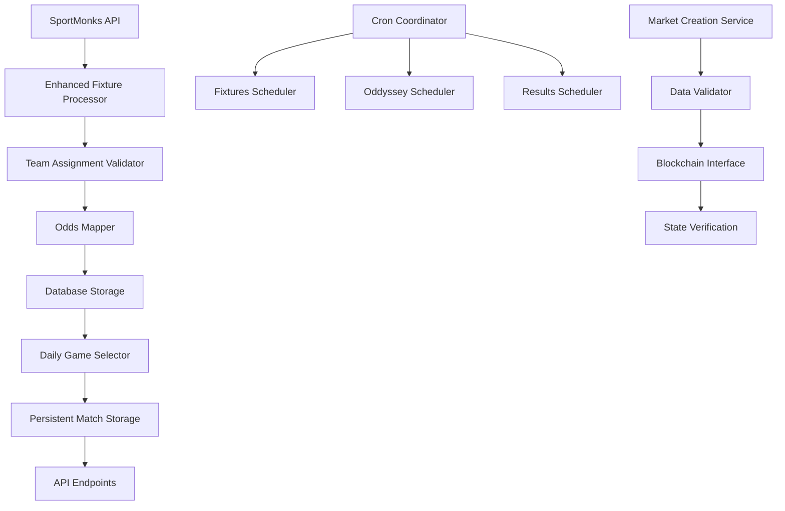

# Design Document

rnd_pymQjZiXkSvslScuEdayNWtb4ela

## Overview

This design addresses critical issues in the Bitredict backend system by implementing fixes for SportMonks data processing, Oddyssey daily game persistence, API reliability, cron job coordination, and prediction market creation robustness. The solution focuses on data integrity, system reliability, and production readiness.

## Architecture

### Core Components

1. **Enhanced SportMonks Service** - Improved fixture processing with correct team assignment
2. **Persistent Daily Game Manager** - Ensures consistent daily match selection
3. **Robust API Layer** - Reliable endpoints with proper error handling
4. **Coordinated Cron System** - Prevents conflicts and ensures proper execution order
5. **Production-Ready Market Creation** - Handles edge cases and provides proper validation

### Data Flow



## Components and Interfaces

### 1. Enhanced SportMonks Service

**Purpose:** Fix team assignment and odds mapping issues

**Key Methods:**
- `processFixturesWithValidation(fixtures)` - Process fixtures with enhanced team detection
- `validateTeamAssignment(fixture)` - Ensure correct home/away assignment
- `mapOddsToTeams(fixture, odds)` - Correctly associate odds with teams
- `detectTeamPositions(participants)` - Multiple fallback methods for team detection

**Team Detection Logic:**
1. Primary: Use `meta.location` field (home/away)
2. Secondary: Use `meta.home`/`meta.away` boolean flags
3. Tertiary: Use array position (index 0 = home, index 1 = away)
4. Validation: Ensure teams are different and have valid names

### 2. Persistent Daily Game Manager

**Purpose:** Ensure consistent daily match selection that never changes

**Key Methods:**
- `selectAndPersistDailyMatches(date)` - Select 10 matches for a specific date
- `getDailyMatches(date)` - Retrieve pre-selected matches
- `validateMatchPersistence(date)` - Ensure matches exist and are complete
- `preventOverwrite(date)` - Block attempts to modify existing selections

**Storage Strategy:**
- Use `oddyssey.daily_game_matches` as single source of truth
- Include complete fixture and odds data in storage
- Implement date-based partitioning for performance
- Add constraints to prevent duplicate selections

### 3. Robust API Layer

**Purpose:** Provide reliable endpoints with proper error handling

**Enhanced Endpoints:**
- `GET /api/oddyssey/matches` - Returns persistent daily matches
- `GET /api/oddyssey/matches/:date` - Date-specific match retrieval
- `POST /api/oddyssey/populate-matches` - Admin endpoint for match selection
- `GET /api/oddyssey/health` - Health check endpoint

**Error Handling Strategy:**
- Structured error responses with error codes
- Detailed logging for debugging
- Graceful degradation when data is missing
- Input validation and sanitization

### 4. Coordinated Cron System

**Purpose:** Prevent conflicts and ensure proper execution order

**Coordination Strategy:**
- Database-based locking mechanism
- Sequential execution with dependency management
- Retry logic with exponential backoff
- Health monitoring and alerting

**Execution Order:**
1. Fixtures Scheduler (00:30 UTC) - Fetch and process fixtures
2. Oddyssey Scheduler (01:00 UTC) - Select daily matches
3. Results Scheduler (hourly) - Update match results

### 5. Production-Ready Market Creation

**Purpose:** Handle edge cases and provide robust market creation

**Validation Pipeline:**
1. Data completeness check
2. Odds validation and normalization
3. Blockchain state verification
4. Transaction simulation
5. Actual execution with monitoring

## Data Models

### Enhanced Fixture Model
```sql
-- Add validation fields to existing fixtures table
ALTER TABLE oracle.fixtures ADD COLUMN IF NOT EXISTS 
  team_assignment_validated BOOLEAN DEFAULT FALSE,
  odds_mapping_validated BOOLEAN DEFAULT FALSE,
  processing_errors JSONB DEFAULT '{}';
```

### Daily Game Matches Model
```sql
-- Ensure complete data storage
CREATE TABLE IF NOT EXISTS oddyssey.daily_game_matches (
  id SERIAL PRIMARY KEY,
  fixture_id INTEGER NOT NULL,
  game_date DATE NOT NULL,
  home_team VARCHAR(255) NOT NULL,
  away_team VARCHAR(255) NOT NULL,
  league_name VARCHAR(255) NOT NULL,
  match_date TIMESTAMP NOT NULL,
  home_odds DECIMAL(10,3),
  draw_odds DECIMAL(10,3),
  away_odds DECIMAL(10,3),
  over_25_odds DECIMAL(10,3),
  under_25_odds DECIMAL(10,3),
  display_order INTEGER NOT NULL,
  created_at TIMESTAMP DEFAULT NOW(),
  UNIQUE(game_date, fixture_id),
  UNIQUE(game_date, display_order)
);
```

### Cron Execution Locks
```sql
CREATE TABLE IF NOT EXISTS system.cron_locks (
  job_name VARCHAR(100) PRIMARY KEY,
  locked_at TIMESTAMP NOT NULL,
  locked_by VARCHAR(255) NOT NULL,
  expires_at TIMESTAMP NOT NULL
);
```

## Error Handling

### SportMonks Processing Errors
- Log detailed participant data when team assignment fails
- Skip fixtures with invalid team data rather than corrupting database
- Implement fallback team detection methods
- Validate odds mapping before storage

### API Error Responses
```javascript
{
  success: false,
  error: {
    code: "MATCHES_NOT_FOUND",
    message: "No matches found for the specified date",
    details: {
      date: "2025-01-15",
      reason: "No pre-selected matches in database"
    }
  }
}
```

### Cron Job Error Handling
- Implement circuit breaker pattern for external API calls
- Use exponential backoff for retries
- Send alerts for critical failures
- Maintain detailed execution logs

## Testing Strategy

### Unit Tests
- SportMonks fixture processing with various participant structures
- Team assignment validation with edge cases
- Odds mapping accuracy
- Daily match selection logic

### Integration Tests
- End-to-end fixture processing pipeline
- API endpoint responses with various data states
- Cron job coordination and locking
- Database transaction integrity

### Production Monitoring
- Health check endpoints for all services
- Metrics collection for processing times
- Error rate monitoring and alerting
- Data quality validation checks

## Performance Considerations

### Database Optimization
- Index on `oddyssey.daily_game_matches(game_date)`
- Partition large tables by date
- Use connection pooling for concurrent operations
- Implement query timeout handling

### API Response Optimization
- Cache daily matches for frequently accessed dates
- Use database views for complex queries
- Implement response compression
- Add request rate limiting

### Cron Job Efficiency
- Batch database operations where possible
- Use parallel processing for independent tasks
- Implement incremental updates rather than full refreshes
- Monitor and optimize API call patterns

## Security Considerations

### API Security
- Input validation and sanitization
- Rate limiting per IP/user
- Authentication for admin endpoints
- SQL injection prevention

### Database Security
- Use parameterized queries exclusively
- Implement proper access controls
- Encrypt sensitive configuration data
- Regular security audits of database permissions

### Cron Job Security
- Secure storage of API tokens
- Proper error message sanitization
- Access logging for admin operations
- Environment variable validation