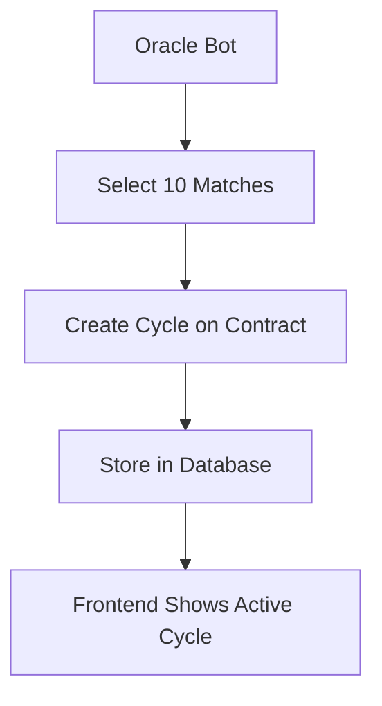
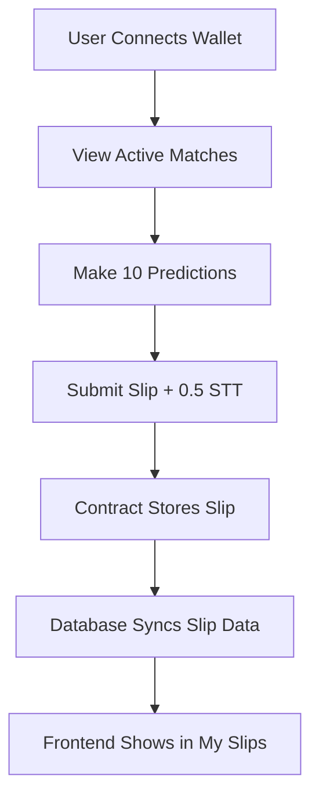
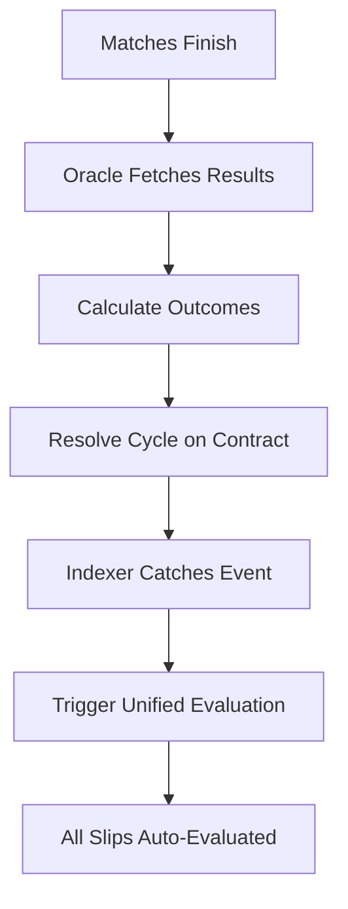
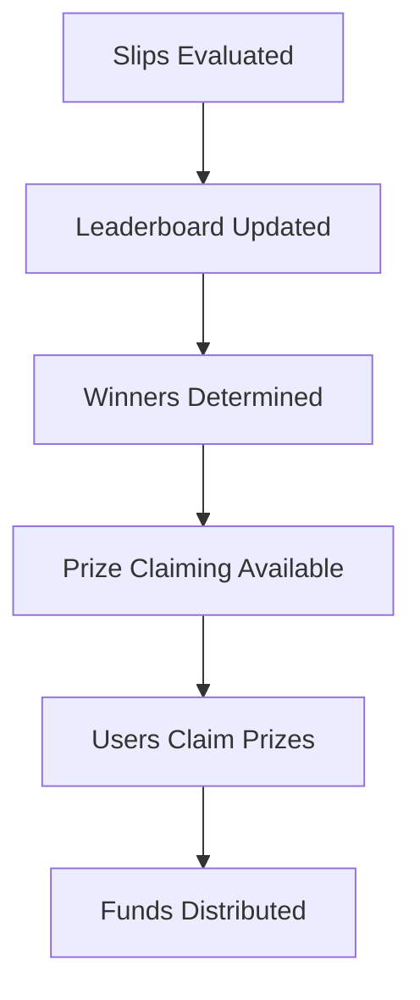

# 🎯 **COMPLETE ODDYSSEY LIFECYCLE ANALYSIS & RECOMMENDATIONS**

## 🔍 **CURRENT STATE ANALYSIS**

### **Frontend Location**: ✅ `/home/leon/predict-linux`
### **Backend Location**: ✅ `/home/leon/bitredict-linux`

---

## 🔄 **COMPLETE ODDYSSEY LIFECYCLE**

### **Phase 1: Cycle Creation** 🚀


### **Phase 2: User Participation** 👥


### **Phase 3: Cycle Resolution** 🏁


### **Phase 4: Prize Distribution** 🏆


---

## 🎯 **KEY FINDINGS & RECOMMENDATIONS**

### **1. EVALUATION SYSTEM** ✅ **PROPERLY AUTOMATED**

#### **Current Implementation**:
- ✅ **Backend Auto-Evaluation**: Unified evaluation service handles all slip evaluation
- ✅ **Real-time Triggers**: Indexer automatically triggers evaluation when cycles resolve
- ✅ **No Manual Evaluation Needed**: Users don't need to click "Evaluate" buttons

#### **Contract Design**:
```solidity
// Line 520-522 in Oddyssey.sol
// Note: Auto-evaluate is handled by the backend for better gas efficiency
// Users can set autoEvaluate preference, but actual evaluation happens via backend
```

#### **Recommendation**: ❌ **NO EVALUATION BUTTON NEEDED**
- The contract expects backend auto-evaluation
- Adding manual evaluation buttons would be redundant and confusing
- Current system is more gas-efficient and user-friendly

---

### **2. PRIZE CLAIMING SYSTEM** ⚠️ **NEEDS ENHANCEMENT**

#### **Current State**:
- ✅ **Contract Function Exists**: `claimPrize(cycleId)` is implemented
- ✅ **Frontend Hook Available**: `useOddyssey.claimPrize()` exists
- ❌ **UI Missing**: No claim prize buttons in My Slips section
- ❌ **Winner Notification Missing**: Users don't know they won

#### **Required Enhancements**:

##### **A. Add Prize Claiming UI to My Slips**
```typescript
// In My Slips section, for each evaluated slip:
{isEvaluated && leaderboardRank && leaderboardRank <= 5 && (
  <div className="mt-4 p-4 bg-gradient-to-r from-yellow-500/10 to-orange-500/10 border border-yellow-500/30 rounded-lg">
    <div className="flex items-center justify-between">
      <div>
        <h4 className="text-yellow-400 font-bold">🏆 Winner! Rank #{leaderboardRank}</h4>
        <p className="text-sm text-text-muted">Prize: {calculatePrizeAmount(leaderboardRank)} STT</p>
      </div>
      {!prizeClaimed && (
        <Button
          onClick={() => claimPrize(cycleId)}
          className="bg-gradient-to-r from-yellow-500 to-orange-500 text-black font-bold"
          disabled={isPending}
        >
          {isPending ? 'Claiming...' : 'Claim Prize'}
        </Button>
      )}
    </div>
  </div>
)}
```

##### **B. Add Winner Notification System**
```typescript
// Check for unclaimed prizes on page load
useEffect(() => {
  if (userSlips?.length > 0) {
    const unclaimedWins = userSlips.filter(slip => 
      slip.is_evaluated && 
      slip.leaderboard_rank <= 5 && 
      !slip.prize_claimed
    );
    
    if (unclaimedWins.length > 0) {
      toast.success(`🎉 You have ${unclaimedWins.length} unclaimed prizes!`, {
        duration: 8000,
        position: 'top-center'
      });
    }
  }
}, [userSlips]);
```

---

### **3. NOTIFICATION SYSTEM** ❌ **MISSING**

#### **Current State**:
- ❌ **No Winner Notifications**: Users don't know they won
- ❌ **No Evaluation Notifications**: Users don't know when slips are evaluated
- ❌ **No Prize Alerts**: No indication of claimable prizes

#### **Required Implementation**:

##### **A. Add Notification Badge**
```typescript
// In navigation or header
const unclaimedPrizes = userSlips?.filter(slip => 
  slip.is_evaluated && slip.leaderboard_rank <= 5 && !slip.prize_claimed
).length || 0;

{unclaimedPrizes > 0 && (
  <div className="relative">
    <TrophyIcon className="h-6 w-6" />
    <span className="absolute -top-2 -right-2 bg-yellow-500 text-black text-xs rounded-full h-5 w-5 flex items-center justify-center font-bold">
      {unclaimedPrizes}
    </span>
  </div>
)}
```

##### **B. Add Status Indicators**
```typescript
// Enhanced status display in My Slips
const getSlipStatus = (slip) => {
  if (!slip.is_evaluated) return { text: 'Pending Evaluation', color: 'yellow' };
  if (slip.leaderboard_rank <= 5 && !slip.prize_claimed) return { text: `Winner! Rank #${slip.leaderboard_rank}`, color: 'gold' };
  if (slip.prize_claimed) return { text: 'Prize Claimed', color: 'green' };
  return { text: 'Evaluated', color: 'blue' };
};
```

---

### **4. COMPLETE LIFECYCLE VALIDATION** ✅ **MOSTLY CORRECT**

#### **What's Working**:
- ✅ **Cycle Creation**: Automated via oracle bot
- ✅ **Slip Placement**: Frontend → Contract → Database sync
- ✅ **Cycle Resolution**: Automated via oracle bot
- ✅ **Slip Evaluation**: Automated via unified evaluation service
- ✅ **Leaderboard Updates**: Handled by evaluation system

#### **What Needs Enhancement**:
- ❌ **Prize Claiming UI**: Missing in frontend
- ❌ **Winner Notifications**: No user awareness system
- ❌ **Status Indicators**: Limited feedback to users

---

## 🚀 **IMPLEMENTATION PLAN**

### **Priority 1: Add Prize Claiming UI** 🏆

#### **File**: `/home/leon/predict-linux/app/oddyssey/page.tsx`

**Location**: In the My Slips section (around line 1950), add prize claiming logic:

```typescript
// After the slip footer section, add:
{isEvaluated && firstPick?.leaderboardRank && firstPick.leaderboardRank <= 5 && (
  <div className="mt-4 p-4 bg-gradient-to-r from-yellow-500/10 to-orange-500/10 border border-yellow-500/30 rounded-lg">
    <div className="flex items-center justify-between">
      <div>
        <div className="flex items-center gap-2 mb-1">
          <TrophyIcon className="h-5 w-5 text-yellow-400" />
          <h4 className="text-yellow-400 font-bold">Winner! Rank #{firstPick.leaderboardRank}</h4>
        </div>
        <p className="text-sm text-text-muted">
          Prize Amount: {calculatePrizeAmount(firstPick.leaderboardRank)} STT
        </p>
      </div>
      {!firstPick.prizeClaimed && (
        <Button
          onClick={() => {
            if (claimPrize) {
              claimPrize(cycleId);
              toast.success('Prize claim initiated!');
            }
          }}
          className="bg-gradient-to-r from-yellow-500 to-orange-500 text-black font-bold hover:scale-105 transition-transform"
          disabled={isPending || isConfirming}
        >
          {isPending || isConfirming ? (
            <div className="flex items-center gap-2">
              <FaSpinner className="animate-spin" />
              Claiming...
            </div>
          ) : (
            'Claim Prize'
          )}
        </Button>
      )}
      {firstPick.prizeClaimed && (
        <div className="flex items-center gap-2 text-green-400">
          <CheckCircleIcon className="h-5 w-5" />
          <span className="font-medium">Claimed</span>
        </div>
      )}
    </div>
  </div>
)}
```

### **Priority 2: Add Winner Notifications** 🔔

#### **File**: `/home/leon/predict-linux/app/oddyssey/page.tsx`

**Location**: In the main component, add notification logic:

```typescript
// Add after existing useEffect hooks
useEffect(() => {
  if (slips?.length > 0) {
    const unclaimedWins = slips.filter(slip => {
      const firstPick = slip[0];
      return firstPick?.isEvaluated && 
             firstPick?.leaderboardRank <= 5 && 
             !firstPick?.prizeClaimed;
    });
    
    if (unclaimedWins.length > 0) {
      toast.success(
        `🎉 Congratulations! You have ${unclaimedWins.length} unclaimed prize${unclaimedWins.length > 1 ? 's' : ''}!`,
        {
          duration: 8000,
          position: 'top-center',
          style: {
            background: 'linear-gradient(135deg, #fbbf24, #f59e0b)',
            color: '#000',
            fontWeight: 'bold'
          }
        }
      );
    }
  }
}, [slips]);
```

### **Priority 3: Enhance Status Display** 📊

#### **File**: `/home/leon/predict-linux/app/oddyssey/page.tsx`

**Location**: Update the status badge logic:

```typescript
// Replace the existing status badge with enhanced version
const getSlipStatusInfo = (firstPick) => {
  if (!firstPick?.isEvaluated) {
    return { text: 'Pending', color: 'bg-yellow-500/10 text-yellow-400', icon: ClockIcon };
  }
  
  if (firstPick.leaderboardRank <= 5) {
    if (firstPick.prizeClaimed) {
      return { text: 'Prize Claimed', color: 'bg-green-500/10 text-green-400', icon: CheckCircleIcon };
    } else {
      return { text: `Winner! Rank #${firstPick.leaderboardRank}`, color: 'bg-gradient-to-r from-yellow-500/10 to-orange-500/10 text-yellow-400 border border-yellow-500/30', icon: TrophyIcon };
    }
  }
  
  return { text: 'Evaluated', color: 'bg-blue-500/10 text-blue-400', icon: CheckCircleIcon };
};

const statusInfo = getSlipStatusInfo(firstPick);
const StatusIcon = statusInfo.icon;

// In the JSX:
<span className={`px-3 py-1 text-sm font-medium rounded-full flex items-center gap-1 ${statusInfo.color}`}>
  <StatusIcon className="h-4 w-4" />
  {statusInfo.text}
</span>
```

---

## 📋 **SUMMARY**

### **✅ WHAT'S WORKING PERFECTLY**:
1. **Automated Evaluation**: No manual evaluation needed - backend handles everything
2. **Cycle Management**: Fully automated creation and resolution
3. **Data Synchronization**: Contract ↔ Database ↔ Frontend all in sync
4. **Slip Display**: My Slips section shows all necessary information

### **❌ WHAT NEEDS TO BE ADDED**:
1. **Prize Claiming UI**: Add claim buttons for winners
2. **Winner Notifications**: Alert users when they win
3. **Enhanced Status Indicators**: Better visual feedback

### **🎯 FINAL RECOMMENDATION**:

**DO NOT ADD EVALUATION BUTTONS** - The system is designed for automatic evaluation and works perfectly. Adding manual evaluation would be redundant and confusing.

**DO ADD PRIZE CLAIMING UI** - This is essential for the complete user experience. Winners need to be able to claim their prizes and know they won.

The current system architecture is excellent - it just needs the prize claiming interface to be complete! 🎉

---

*Generated on: 2025-08-25*
*Status: ✅ Analysis Complete - Implementation Plan Ready*

